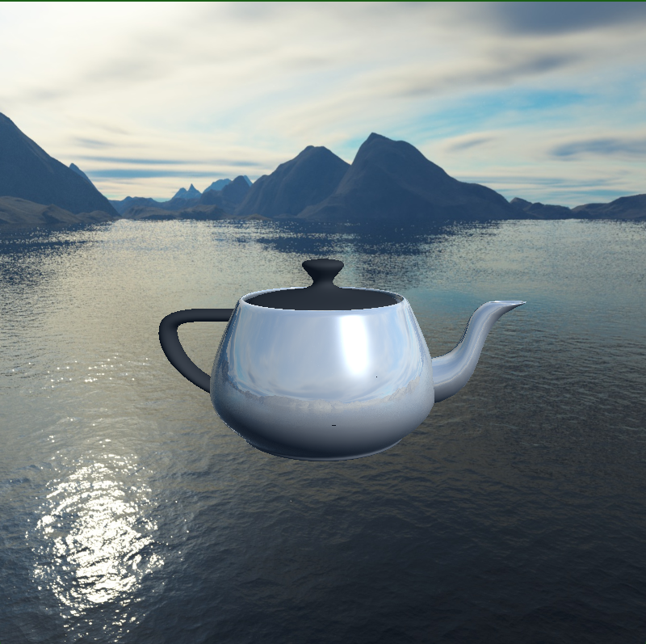

# ITI-OpenGL-Projects
This repo hosts the two OpenGL projects that I made during my time at the Information Technology Institue (ITI)

### Just download the repo and double-click `Generate Projects.bat` to generate a vs2022 solution then build the desired project.

## 1. Skybox
In this project, I created a scene consisting of a 3D model (Teapot), a cubemap (Skybox), and a directional light.

* The cubemap is textured using six individual 2D textures representing the environment.

* The directional light has three different components; Diffuse Lighting, Specular Lighting, and Ambient Lighting.

* The teapot is semi-reflective. It partially reflects the skybox and is affected by the directional light at the same time.

* The teapot's handle and lid are not reflective, and both have a (black/grey) color. This effect was made possible using two different 2D textures; a diffuse texture and a specular texture.

</img>

## 2. Spotlight
Will be uploaded soon...